[TOC]

## Installation

[Getting Started - Argo CD - Declarative GitOps CD for Kubernetes (argoproj.github.io)](https://argoproj.github.io/argo-cd/getting_started/)

## Create An Application From A Git Repository

### Prepare GitLab repo
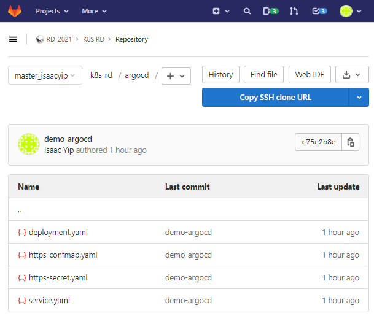

### Connection Repo
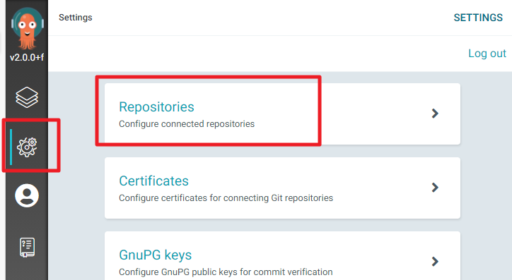
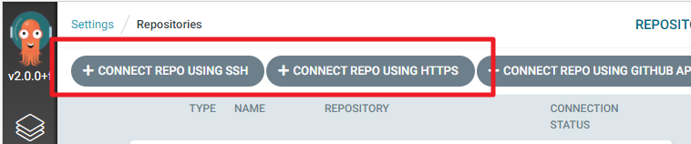
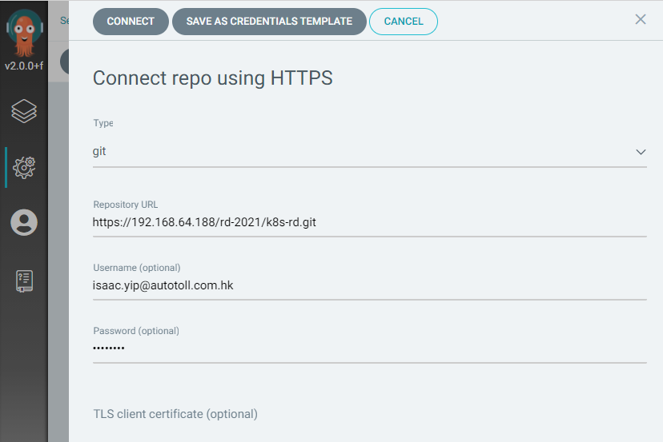

### Deploy an app from GitLab repo
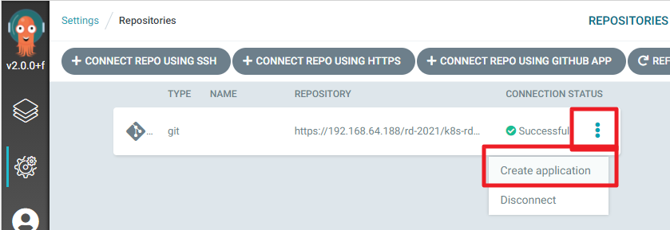
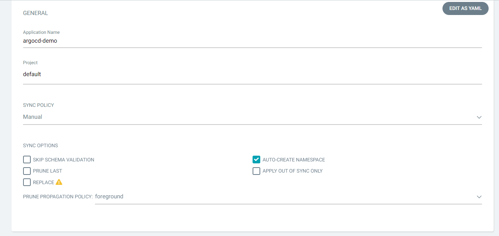
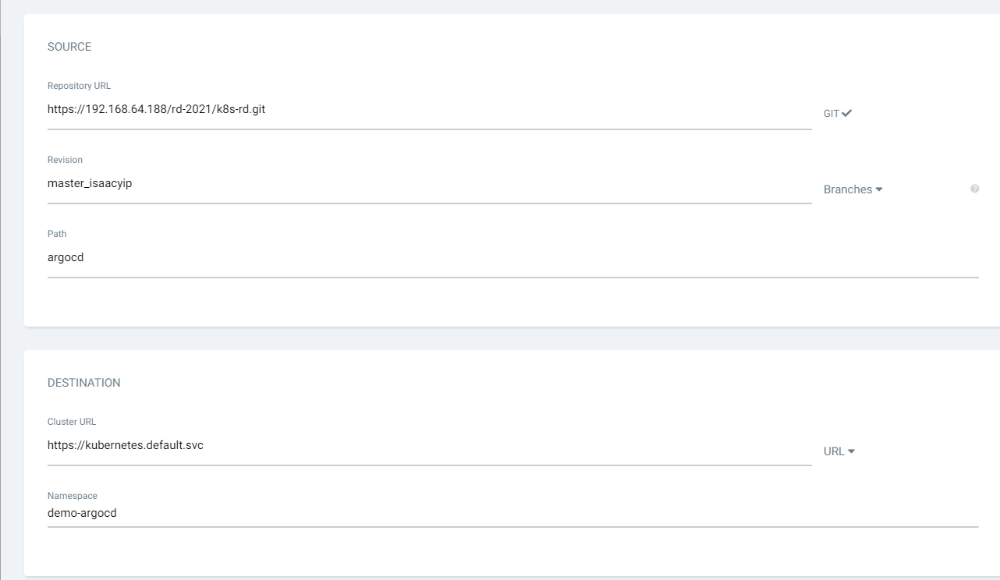
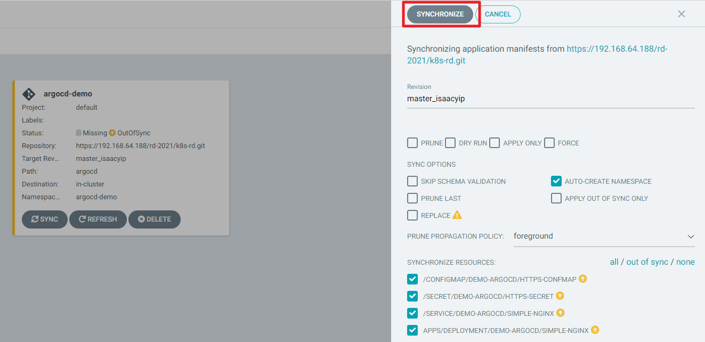
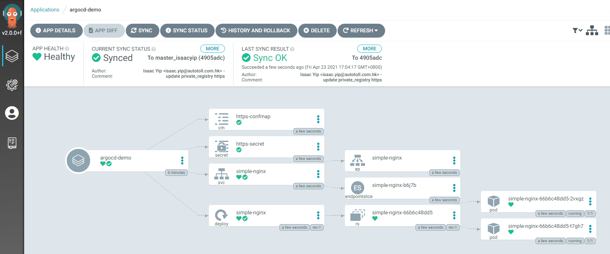

### Upgrade image from Nginx 1.14.2 to 1.9
1. Modify deployment.yaml file on GitLab and commit.
   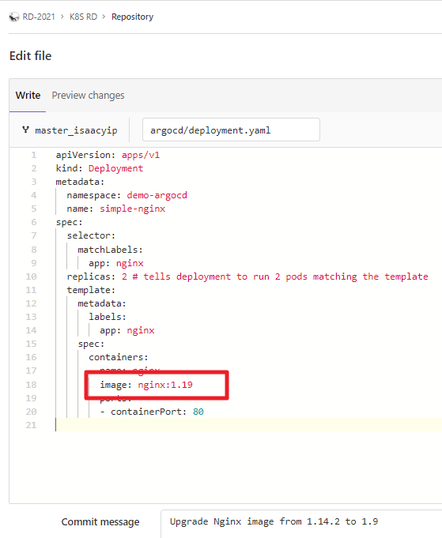

2. Go to ArgoCD and you will see OutOfSync, click `MORE` will show the commit message we just wrote.
   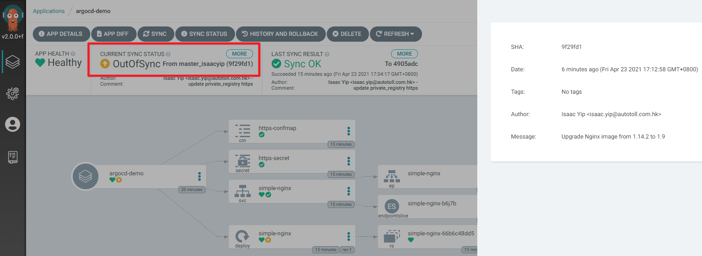

3. Click `SYNC` button to sync the app
   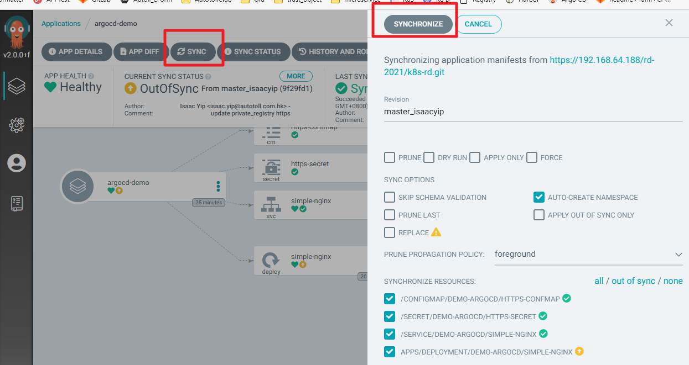

4. SYNC Status will show the latest commit message.
   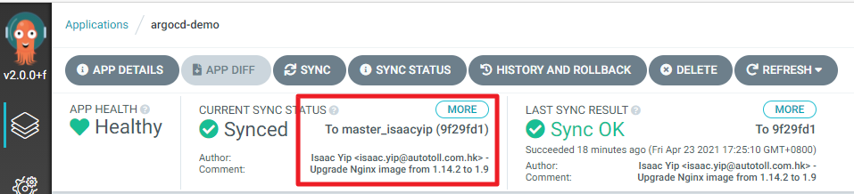

   

### Rollback
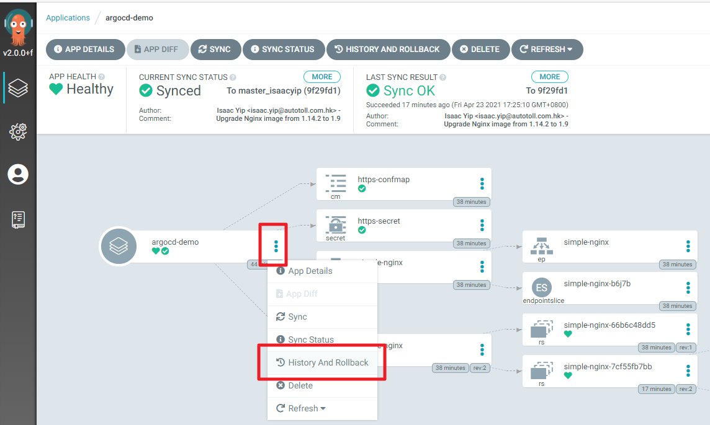
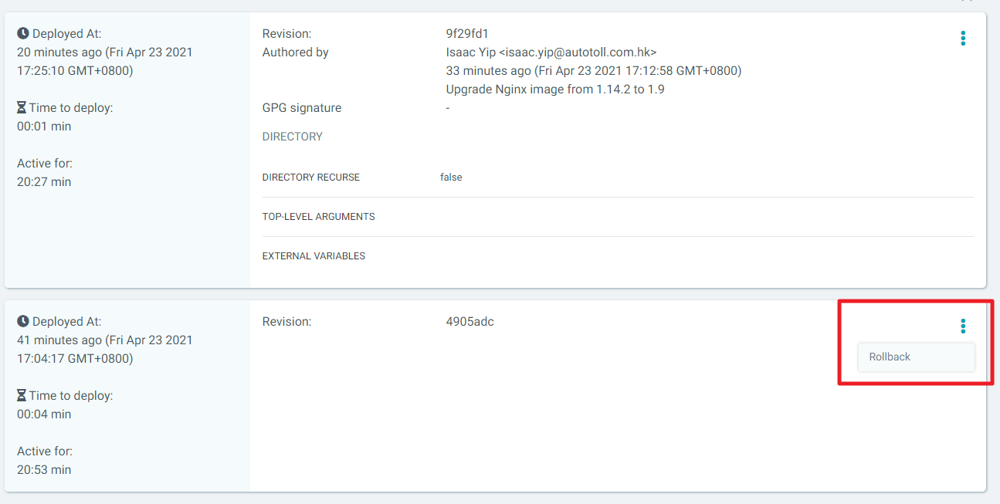

