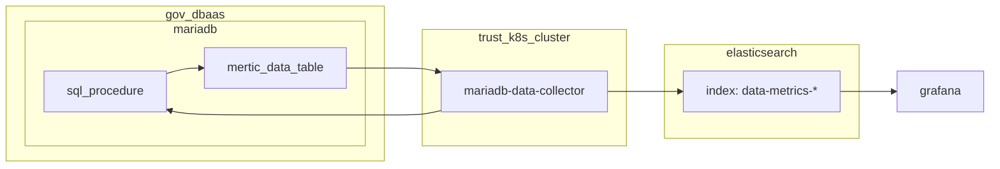
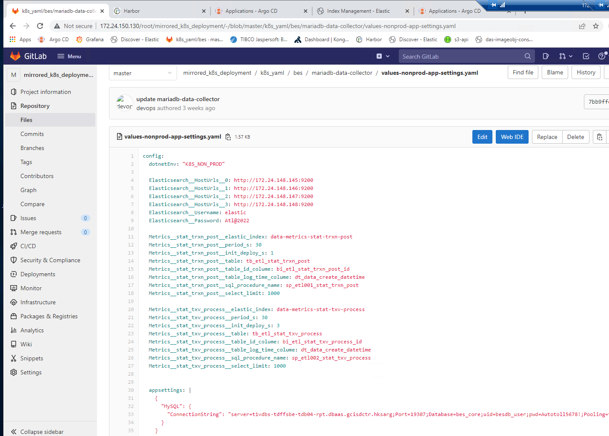

# bes_data_dashborad

## concept

1. `mariadb-data-collector` will execute sql_procedure, this sql_procedure should generate mertic data to a table.
2. than `mariadb-data-collector` send mertic data to elasticsearch. index name should start with `data-metrics-`
3. setup grafana dashboard for it

## mariadb-data-collector config

