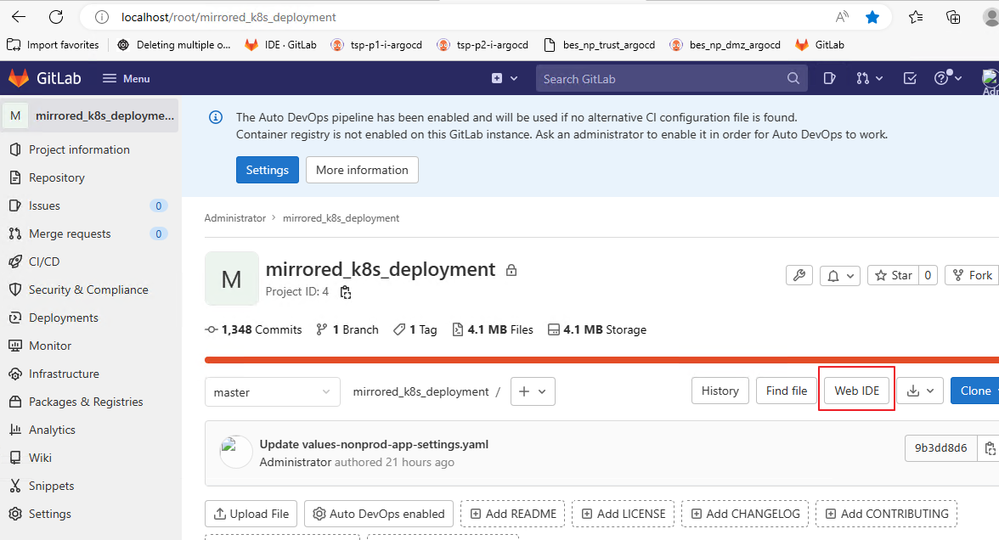
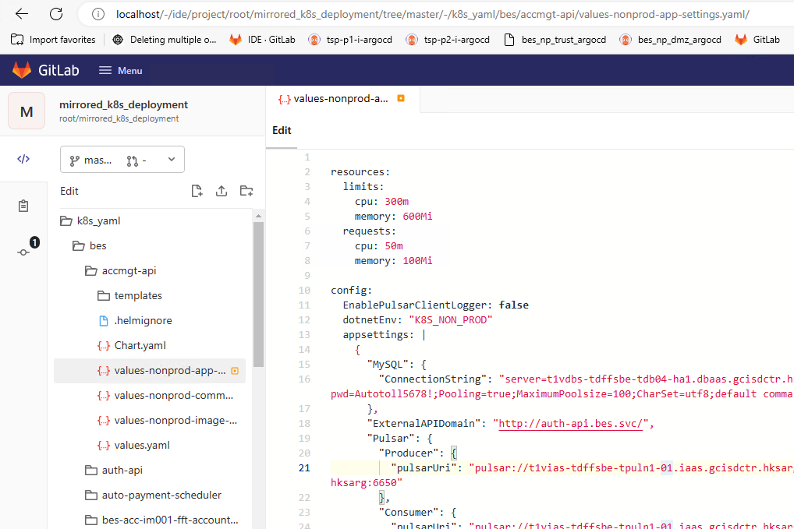
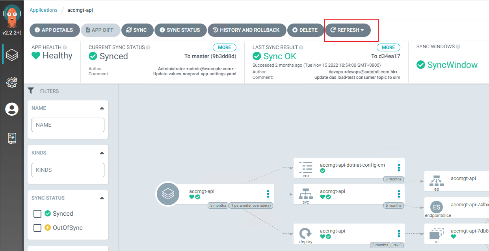
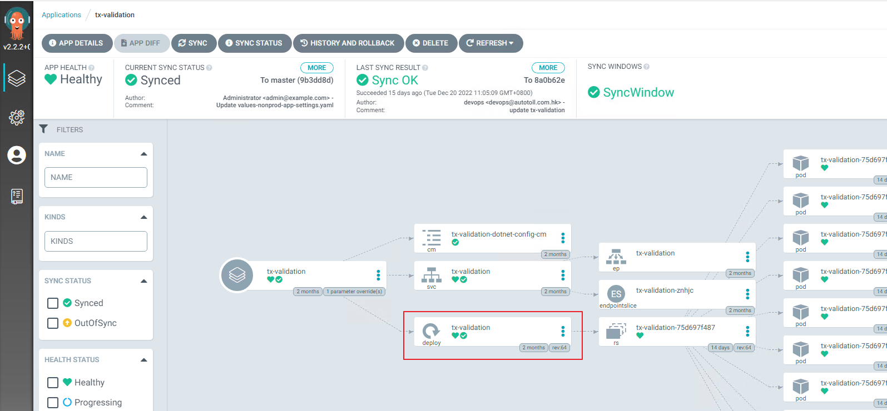
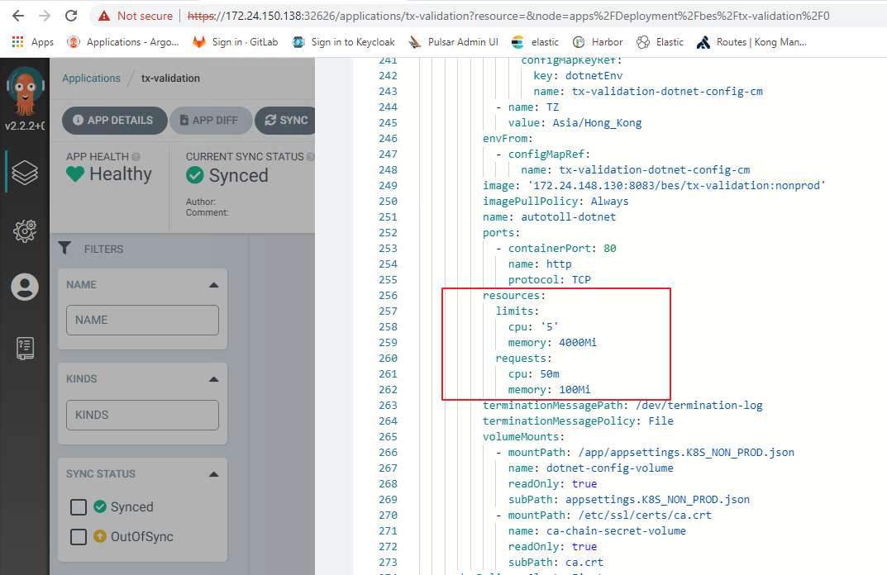

1. open ssh tunnel [np_trust_ssh_tunnel.bat](np_trust_ssh_tunnel.bat)
2. open gitlab project [http://localhost/root/mirrored_k8s_deployment](http://localhost/root/mirrored_k8s_deployment)
3. open Web IDE
   

4. add below to `values-nonprod-app-settings.yaml`

   ```yaml
   resources:
     limits:
       cpu: 300m
       memory: 600Mi
     requests:
       cpu: 50m
       memory: 100Mi
   ```

   

5. open argocd, refresh app
   
6. check for sure
   
   

7. check pod cpu/memory usage
   ```bash
   ssh user00@172.24.150.138
   watch 'kubectl top pod -n bes --sort-by=cpu | head -n 30'
   watch 'kubectl top pod -n bes --sort-by=memory | head -n 30'
   ```
