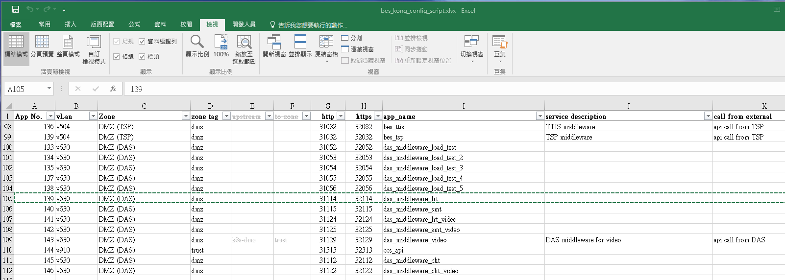
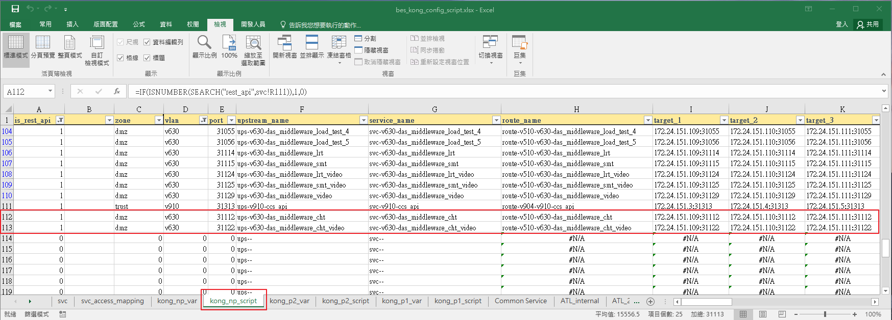
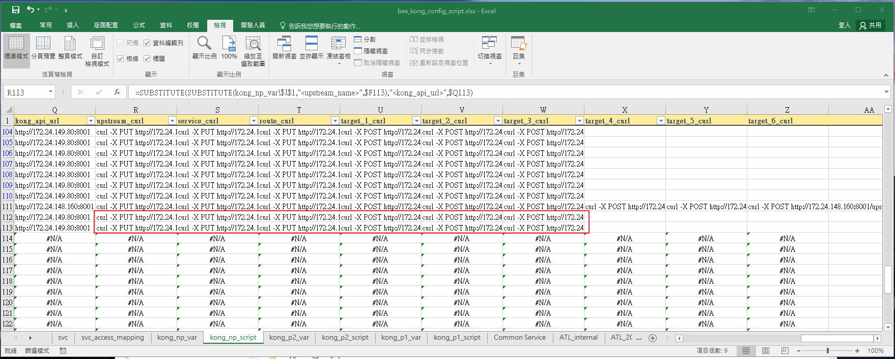

# config kong gateway

1. download excel file `bes_kong_config_script.xlsx`
2. in sheet `svc`, add new service.
3. copy other row (example: row 105 das_middleware_lrt), and change columes `A - I`
   
4. go to sheet `kong_xx_script`, find the row of your service
   
5. copy curl commands from columns `R - Z`. for dmz, columns `X - Z` will be empty
   
6. execute those curl commands in vm `tkongpt1`. dmz or trust zone dosen't metter.
