# create new bes app

For project that `.sln` and `.csproj` file in same directory, see `ccs-api` for example  
For project that `.sln` and `.csproj` file **not** in same directory, see `ccs-scheduler` for example

For web-api, see `ccs-api` for example  
For web-service, see `mariadb-metric-collector` for example  
For cron-job, see `auto-issue-suspend-fsn` for example

## Make sure build docker image

1. add `Dockerfile`, `.dockerignore` files  
   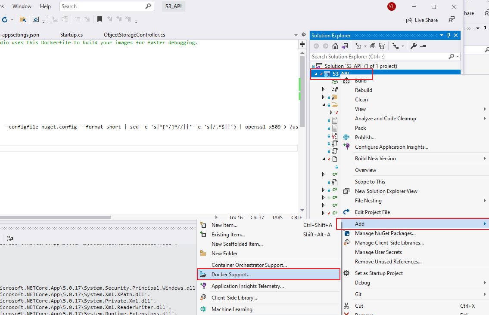
2. add below code in `Dockerfile` after `WORKDIR /src`
   ```bash
   COPY ["nuget.config", "."]
   RUN echo -n | openssl s_client -connect $(dotnet nuget list source --configfile nuget.config --format short | sed -e 's|^[^/]*//||' -e 's|/.    *$||') | openssl x509 > /usr/local/share/ca-certificates/packageSources.crt
   RUN update-ca-certificates
   ```
3. add `.gitlab-ci.yml` file on top directory  
   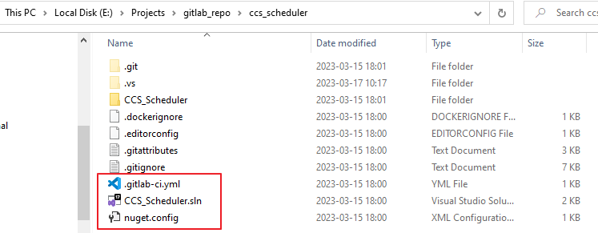

   ```yml
   variables:
     ZONE: "dmz-bes" # dmz-bes | bes | bes-job, trust zone cron job use "bes-job", anything in dmz use "dmz-bes"
     ARGOCD_PROJECT_NAMESPACE: "bes" # don't change this
     ARGOCD_PROJECT_NAME: "ccs-scheduler" # only allow alpha, numeric, hyphen
     HARBOR_REPOSITORIES: "bes/ccs-scheduler"
     DOCKER_FILE_PATH: ./CCS_Scheduler/Dockerfile # or ./Dockerfile

   include:
     - project: "bes/k8s_deployment"
       file: "/gitlab_ci_templates/common.gitlab-ci.yml"
   # cron job dose not need restart, uncomment this only for cronjob
   # restart-argocd-deployment:
   #   only:
   #     - never
   ```

4. commit and push `gitlab-ci.yml` to gitlab, trigger pipline, this should build a image to harbor.  
   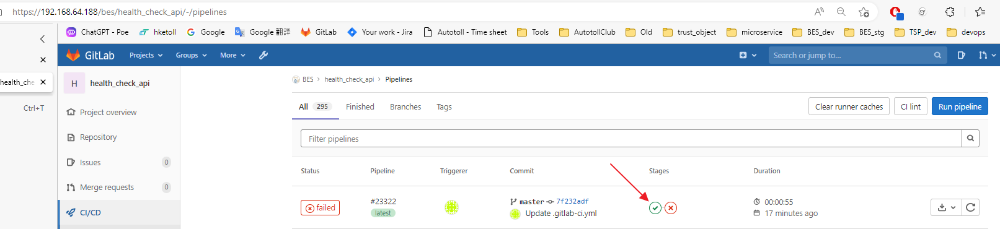

## deploy helm chart to k8s

1. copy helm chart example from `k8s_deployment/helm_charts_example` to `k8s_yaml`  
   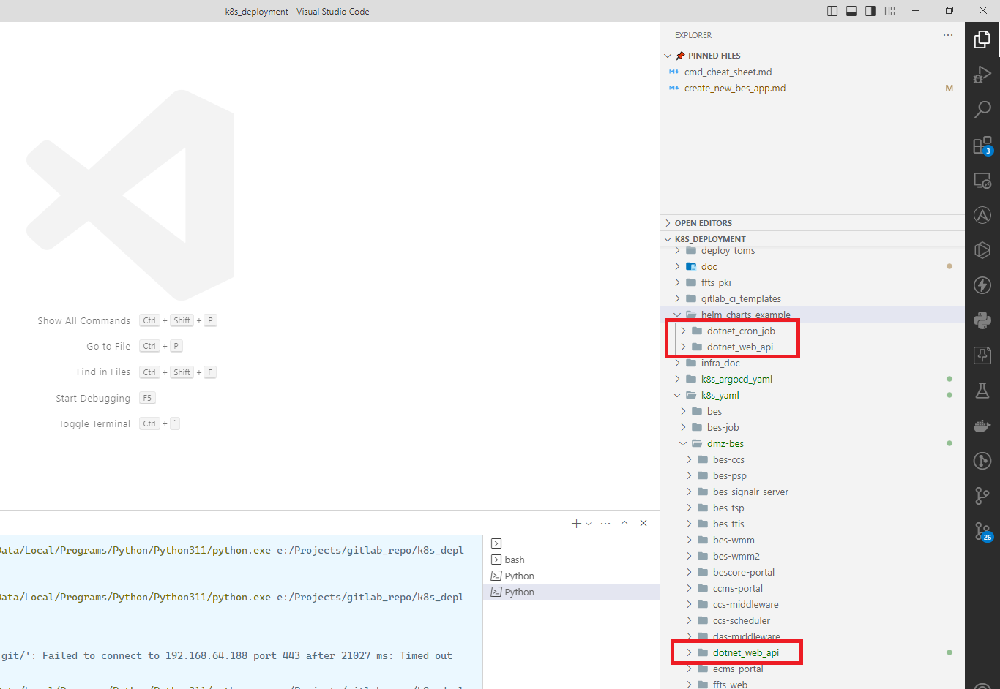
2. than rename folder to your app name. (only allow alpha, numeric, hyphen)  
   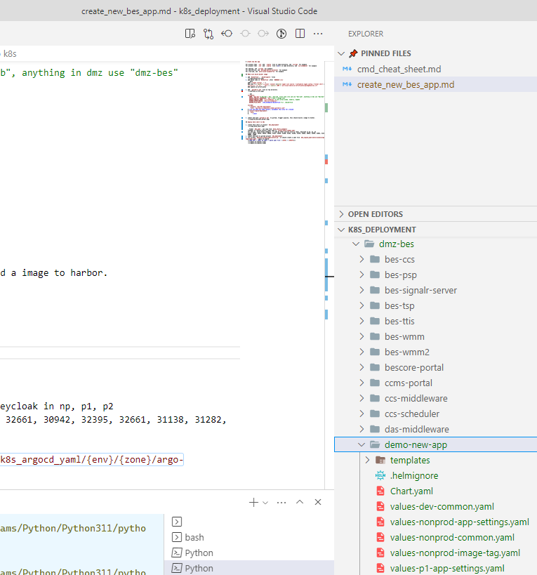
3. replace all "new-app-name" to your app name  
   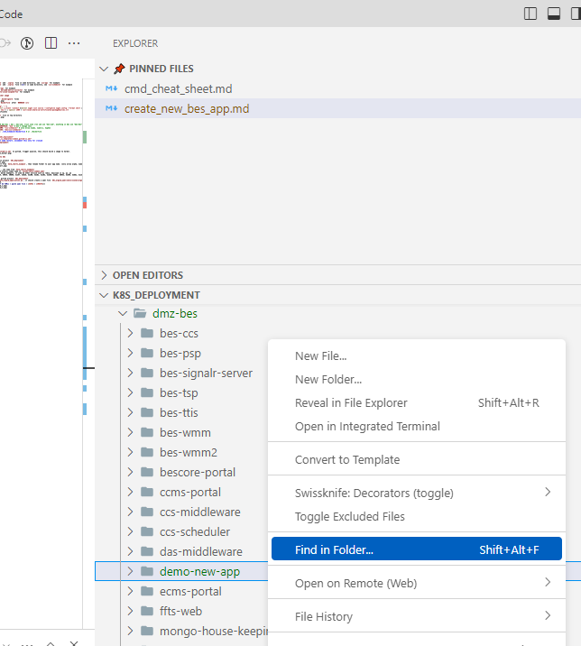  
   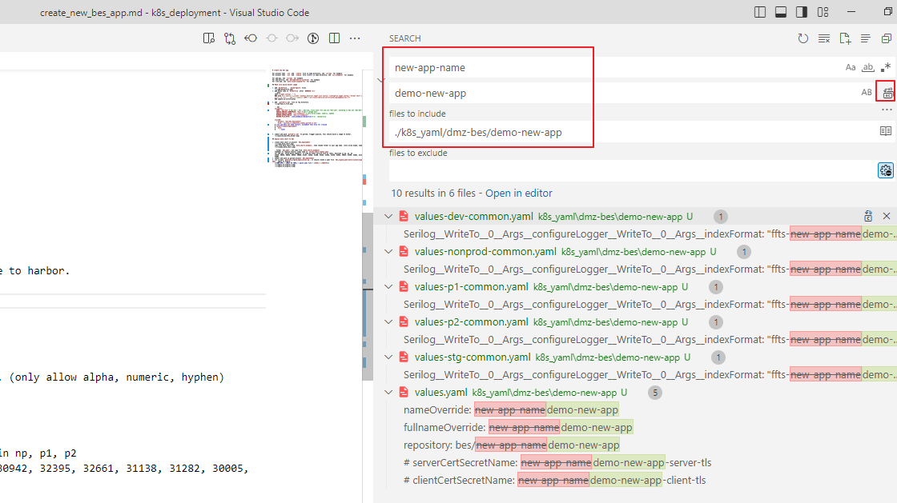
4. for web api, assign a nodeport  
   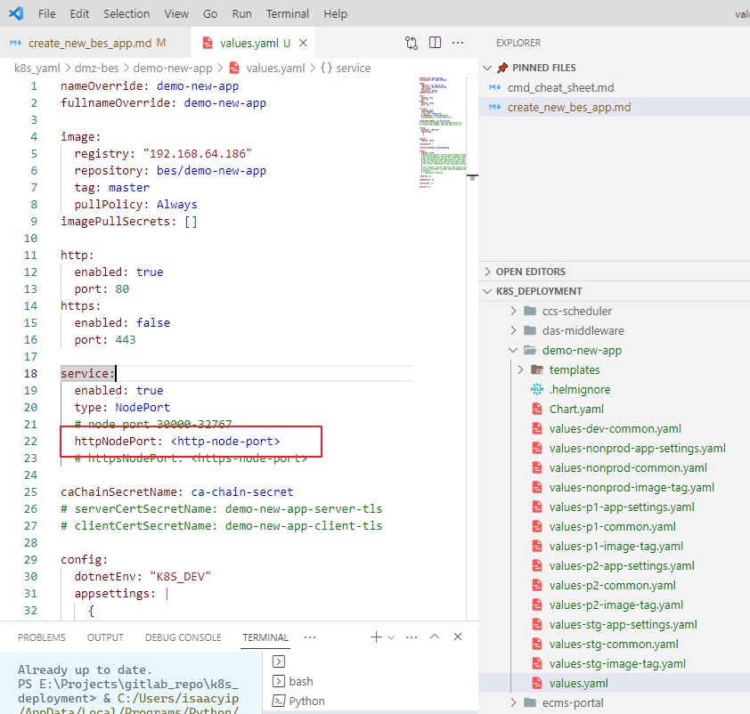  
   avoid below nodeport, it used by other service such as redis, keycloak in np, p1, p2  
   31019, 30233, 30245, 30554, 30898, 31257, 32626, 32100, 32101, 32102, 31339, 32661, 30942, 32395, 32661, 31138, 31282, 30005, 31003
5. for cronjob, assign schedule in values.yaml
6. update `values-{env}-app-settings.yaml`
7. commit and push to gitlab project `k8s_deployment`
8. run scripts `generate_argocd_application.py` in folder `k8s_deployment`  
   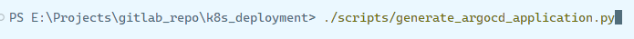
9. it should create yaml file in folder `k8s_deployment/k8s_argocd_yaml`  
   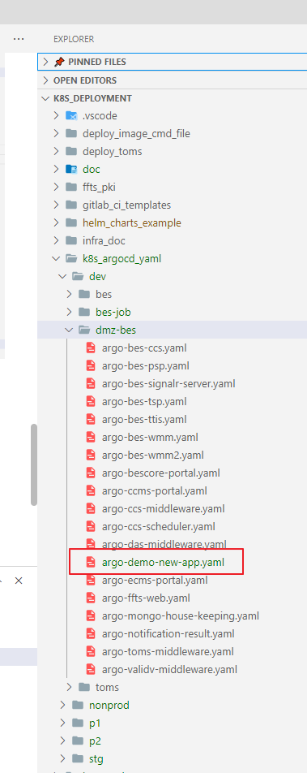
10. copy yaml to argocd.  
    **[NEW APP] > [EDIT AS YAML]**  
    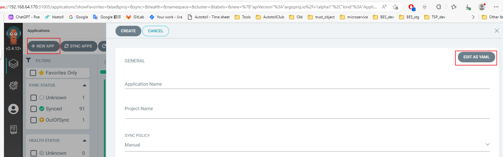  
    **paste yaml file > [SAVE] > [CREATE]**  
    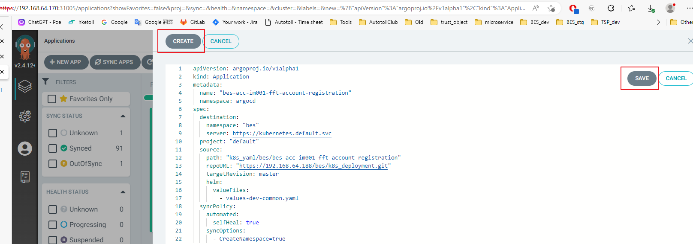
