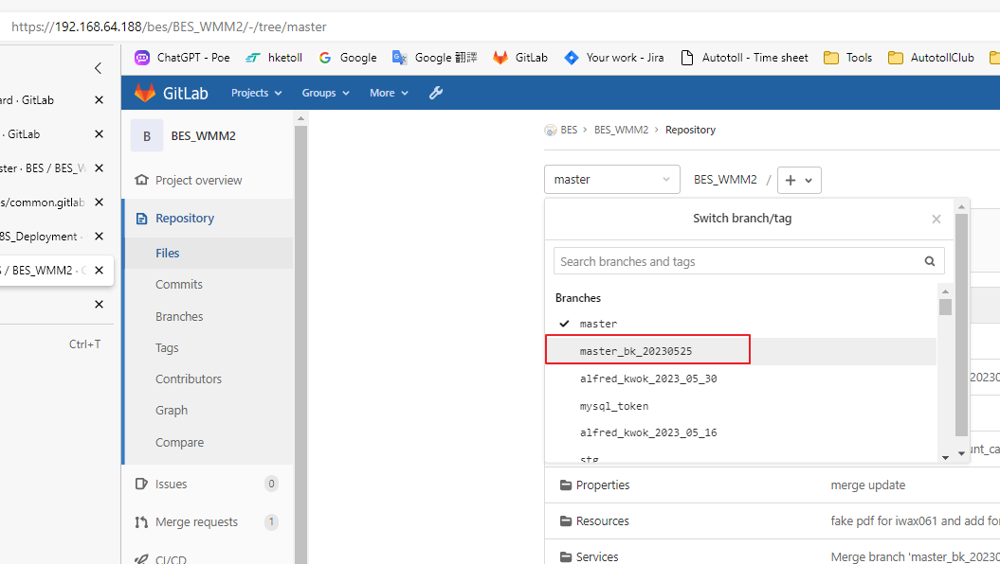
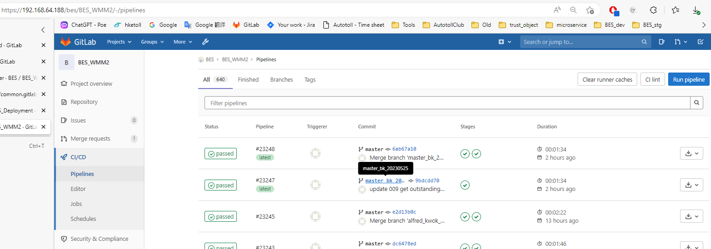
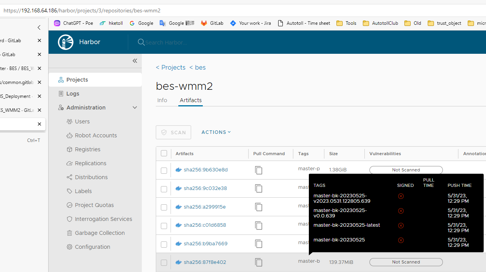
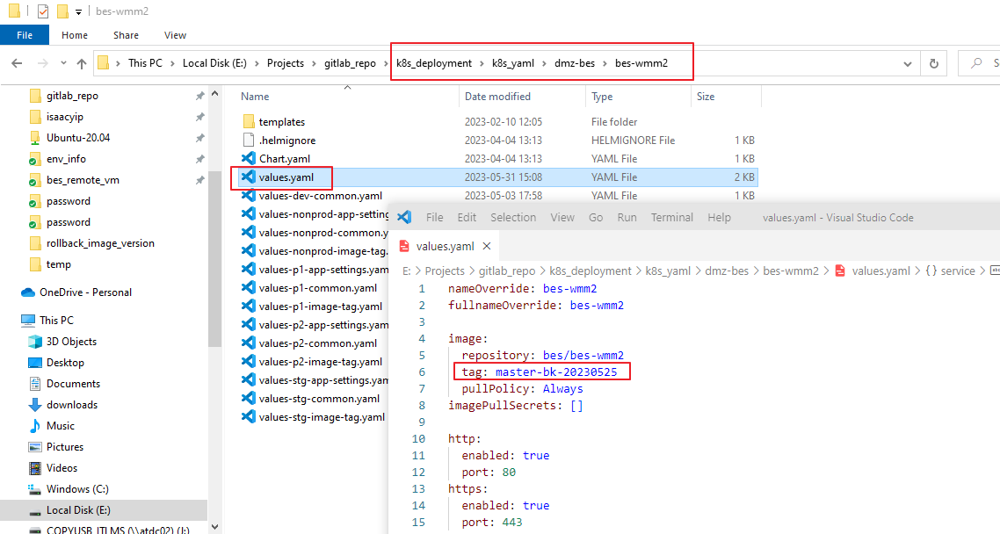

# delpoy_another_branch_to_np

1. make sure branch name start with `master` or `temp` or `dev`, example: `master_bk_20230525`
   
2. pipline will auto build image to harbor
   
3. tag name will be only alphanumeric and hyphen, example: `master-bk-20230525`
   
4. open project `k8s_deployment`, open app values file `k8s_yaml\dmz-bes\bes-wmm2\values.yaml`, temporary change tag, example: `master-bk-20230525` ( do not commit this change to gitlab )
   
5. then follow deploy_app_to_np procuder [here](../deploy_app_to_np/readme.md)
