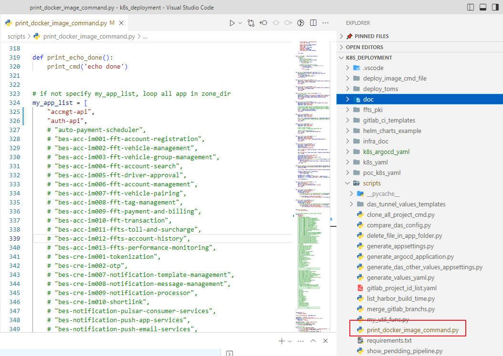
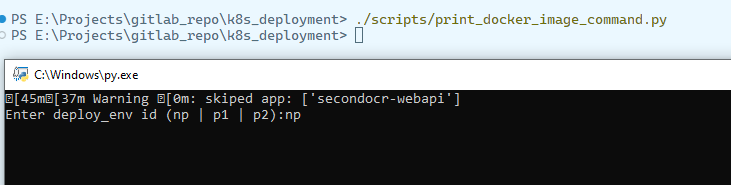
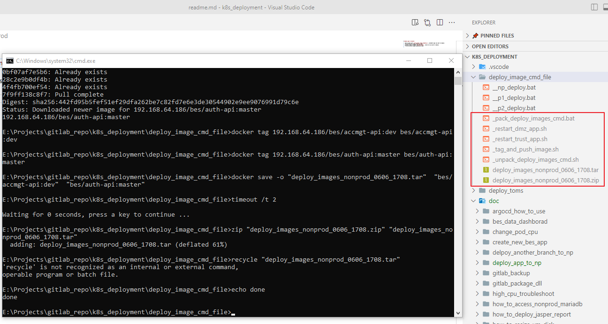
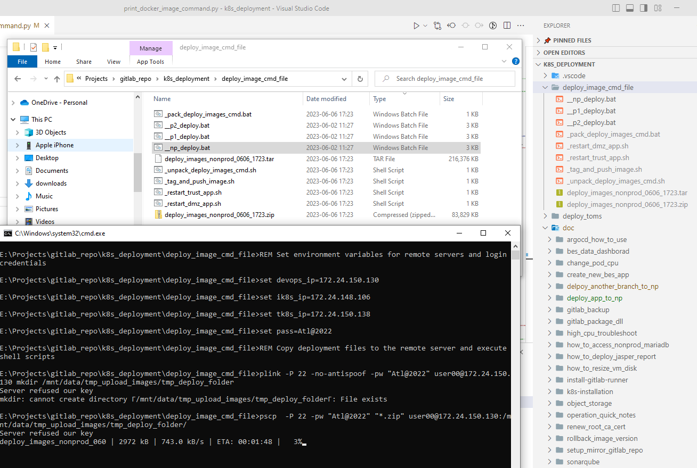

# deploy app to nonprod

1. open scripts file `print_docker_image_command.py`, uncomment apps you want to deploy
   
2. execute script in folder `k8s_deployment`, select env you want to deploy
   
3. it should create some files in folder `k8s_deployment/deploy_image_cmd_file`
   
4. connect Forti VPN 
5. double click batch script `__xx_deploy.bat`
   
