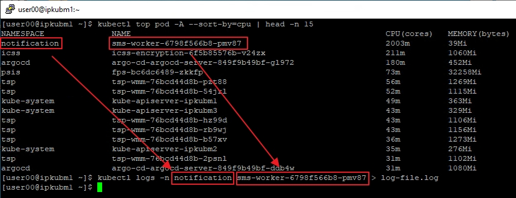
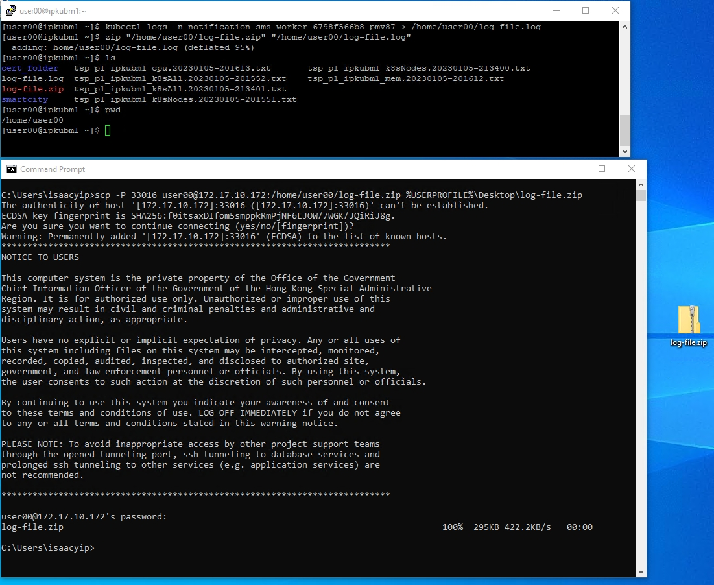

# k8s high cpu troubleshoot

1. connect to vpn
2. ssh to linux k8s master

   ```bash
   # tsp P1 trust zone k8s master 1 (tpkubm1)
   ssh user00@172.17.10.172 -p 35033

   # tsp P1 dmz zone k8s master 1 (ipkubm1)
   ssh user00@172.17.10.172 -p 33016

   # tsp P2 trust zone k8s master 1 (tdkubm1)
   ssh user00@172.17.10.172 -p 35019

   # tsp P2 dmz zone k8s master 1 (idkubm1)
   ssh user00@172.17.10.172 -p 33010
   ```

3. check cpu usage
   ```bash
   # check pod top 15 cpu usage
   # sort by [cpu] or [memory]
   kubectl top pod -A --sort-by=cpu | head -n 15
   # check server cpu
   kubectl top node
   ```

4. download log and zip
   ```bash
   kubectl logs -n notification sms-worker-6798f566b8-pmv87 > /home/user00/log-file.log
   zip "/home/user00/log-file.zip" "/home/user00/log-file.log"
   ## install zip if command not found
   # su -c "yum install zip"
   ```
   

5. use winscp or command download log to your PC  
   **!! execute on your PC**
   ```batch
   scp -P 33016 user00@172.17.10.172:/home/user00/log-file.zip %USERPROFILE%\Desktop\log-file.zip
   ```
   

6. restart app  
   **!! execute on k8s master**
   ```bash
   kubectl rollout restart deploy -n notification sms-worker
   ```

7. if anything stack, force delete pod  
   **!! carefully use**
   ```bash
   kubectl delete pod -n notification sms-worker-6798f566b8-pmv87 --force --now
   ```
