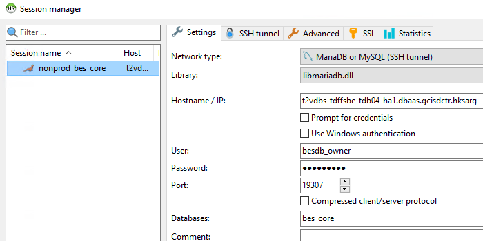
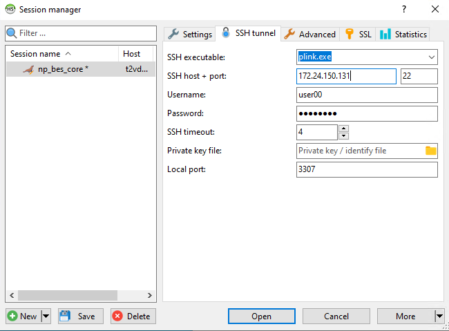
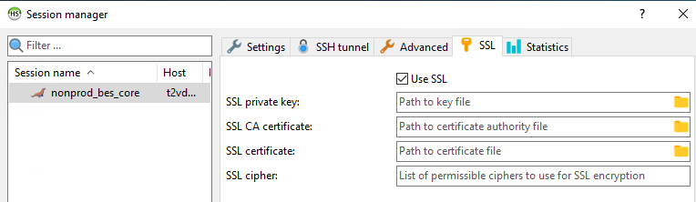

# how_to_access_nonprod_mariadb

## connect nonprod VPN

For bes nonprod

```
FortiClient VPN
Remote Gateway: 202.128.227.2
Customize port: 443
```

## install and use HeidiSQL

### network type must be `SSH tunnel`



### SSH host should be one of trust zone k8s worker ip


### SSL must on

