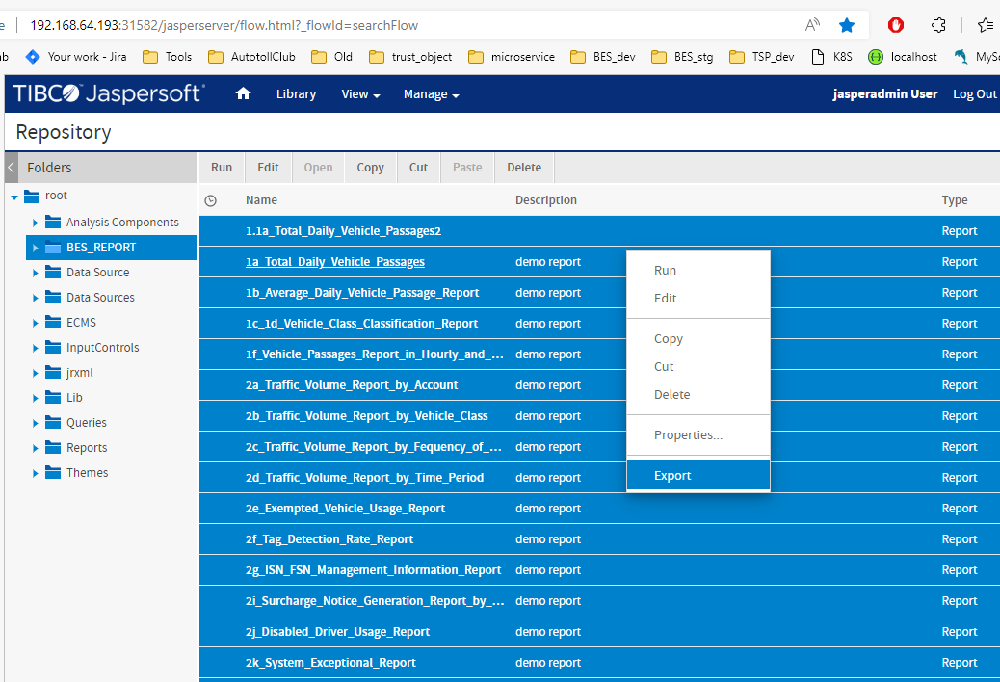
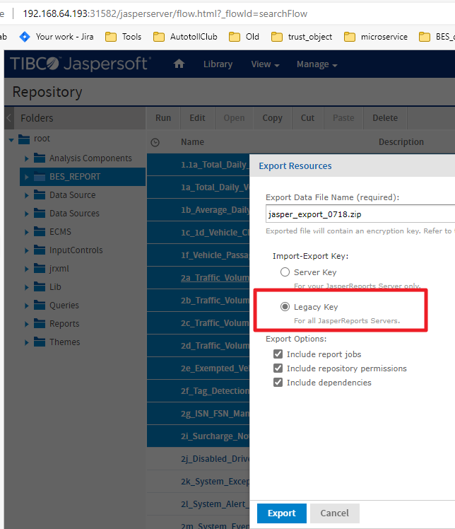
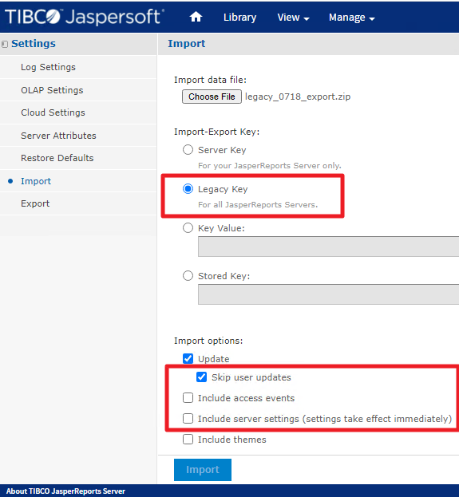
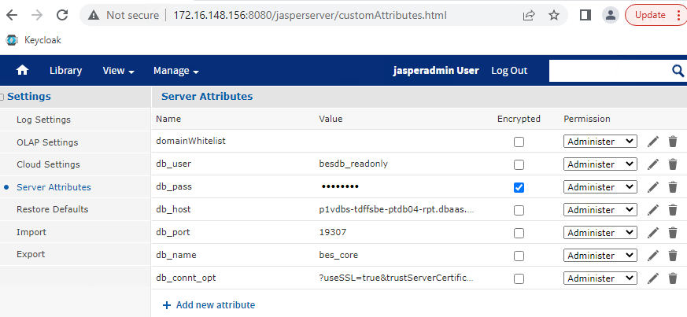
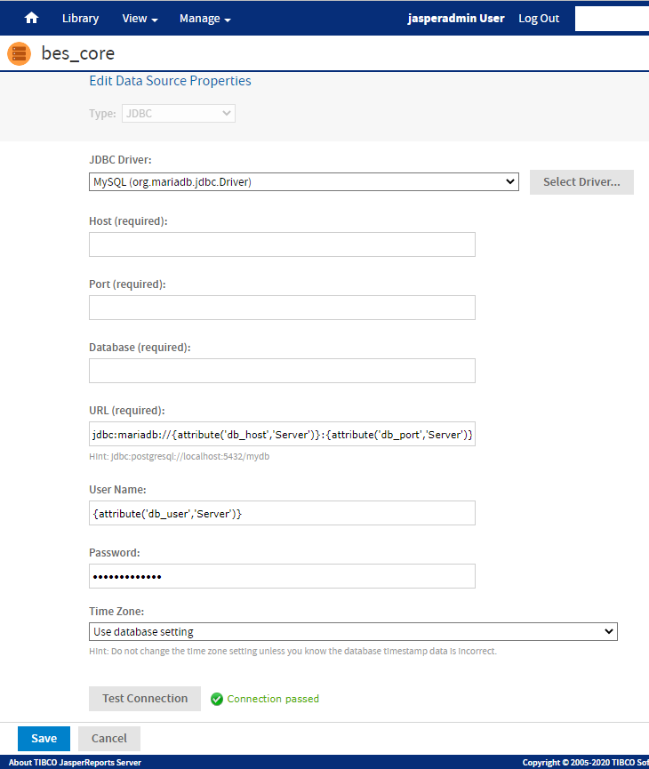

# how to deploy jasper report

## Export

- select the report you want to export
- right click mouse
- click `Export`

- choose `Legacy Key`
- click `Export`

## Import

Open settings page, Manage > Server Settings
Click **_Ixport_** on left menu

- choose import file
- choose `Legacy Key`
- choose `Skip user updates`
- do **_not_** choose `Include access events`
- do **_not_** choose `Include server settings`

After import, check if `Server Attributes ` correct

db_connt_opt: `?useSSL=true&trustServerCertificate=true`

## Data Source

check data source, it should looks like this 
- URL: `jdbc:mariadb://{attribute('db_host2','Server')}:{attribute('db_port2','Server')}/{attribute('db_name2','Server')}{attribute('db_connt_opt2','Server')}`
- User Name: {attribute('db_user','Server')}
- Password: {attribute('db_pass','Server')}  #2Dp0&MBZ

