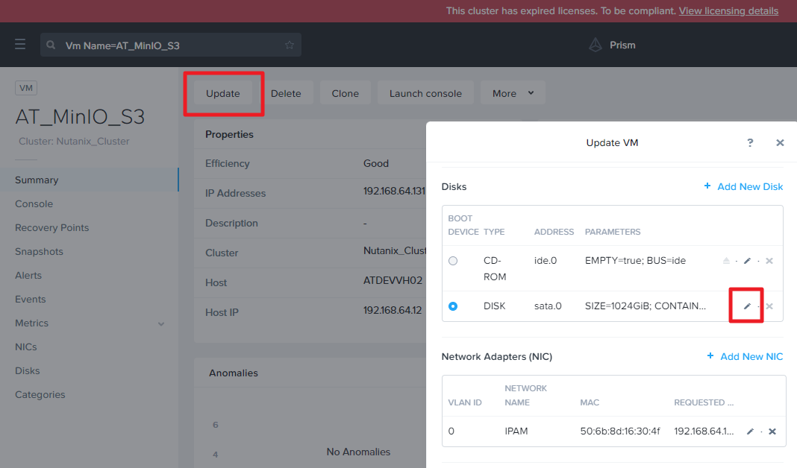

# How to resize vm disk

## Update disk size in nutanix



## Change volume size in vm

doc ref: https://blog.gtwang.org/linux/parted-command-to-create-resize-rescue-linux-disk-partitions/

ssh login VM

```bash
sudo apt install parted
sudo parted
```

```
(parted) help
(parted) print
```

```
Number  Start   End     Size    Type     File system  Flags
 1      1049kB  1100GB  1100GB  primary  ext4         boot
```

`resizepart 1 100%` means resize the `Number 1` disk to use 100% disk space

```
(parted) resizepart 1
(END) 100%
(parted) quit
```

resize file system

```
sudo resize2fs /dev/sda1
df -H
```
