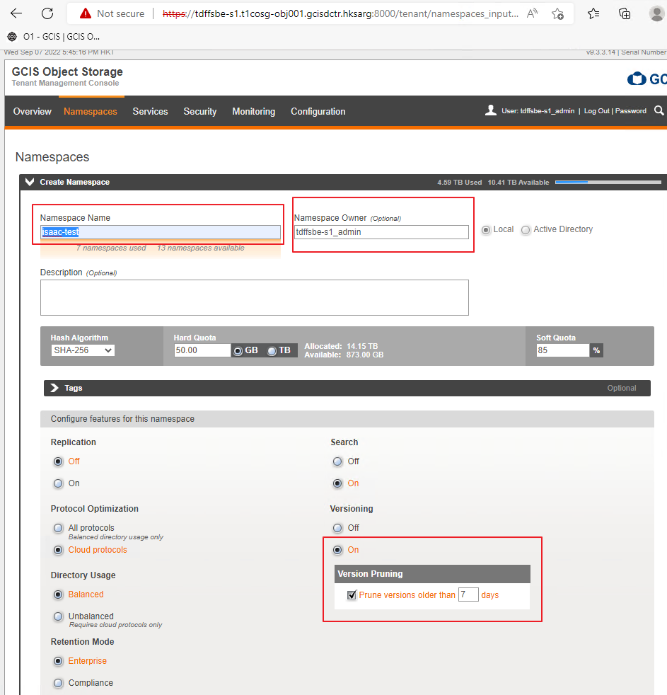
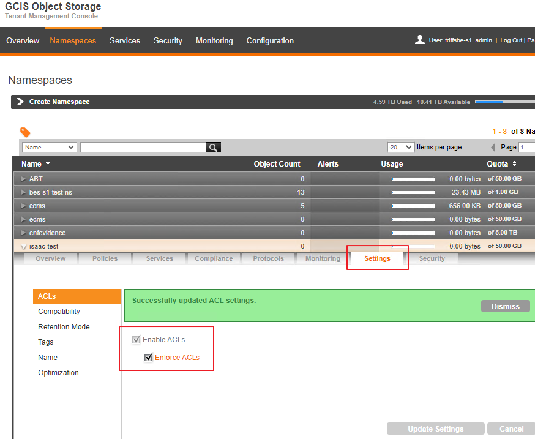
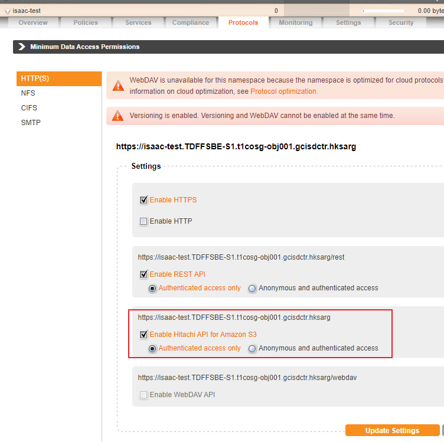
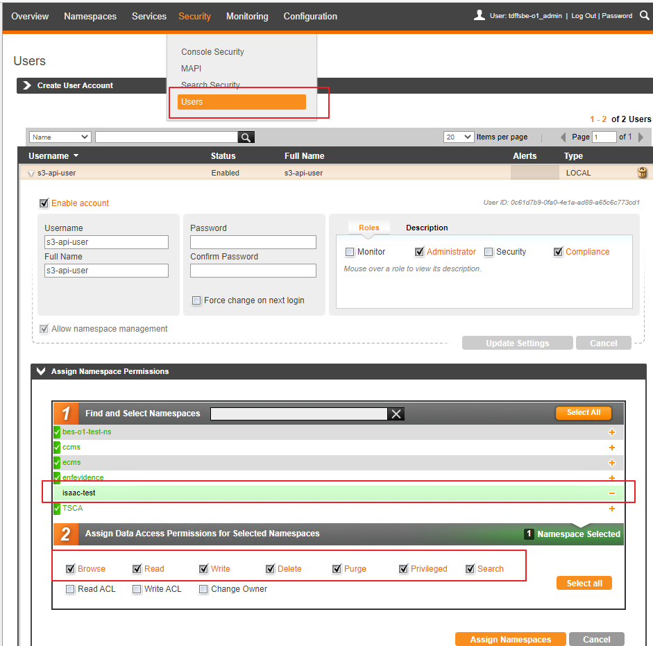
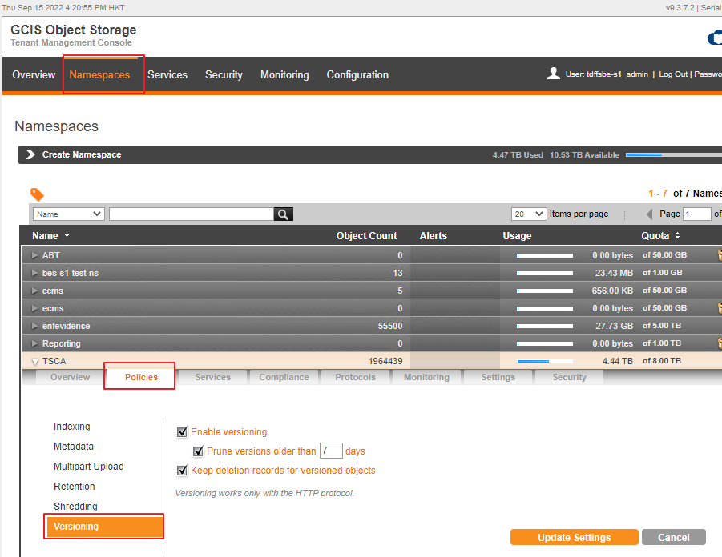
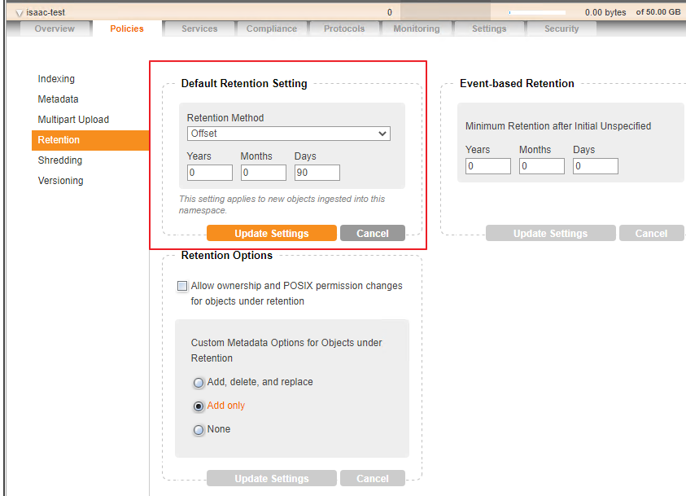
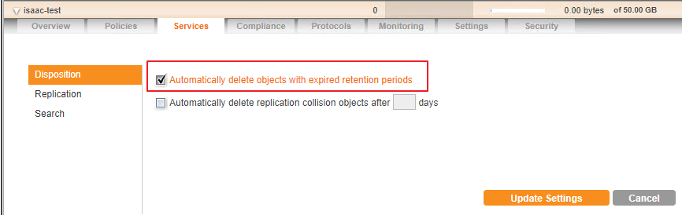
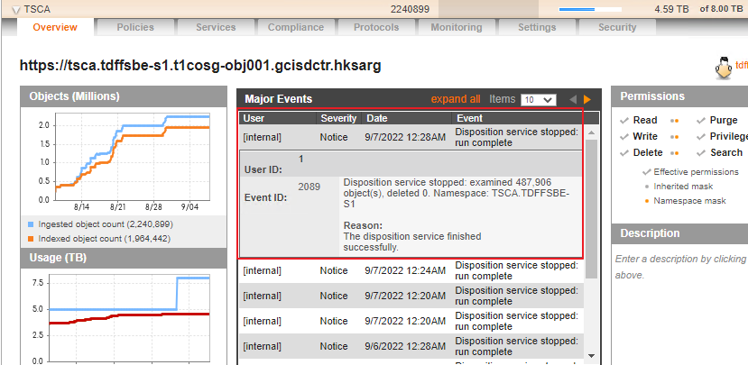
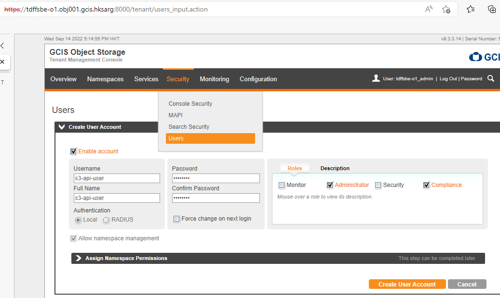

## Create bucket

## Enable s3 api

## Assign permission to user

## Enable versioning (Optional)

## Enable retention (Optional)

### Disposition Service Log

Disposition service scheduled run every day, see event log.

## Create User

## 
