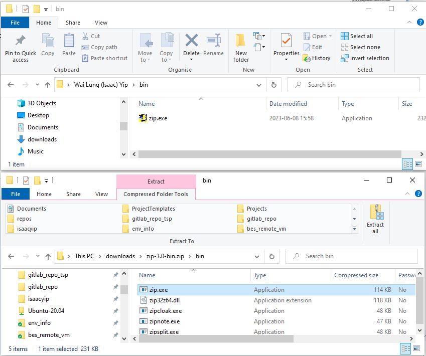
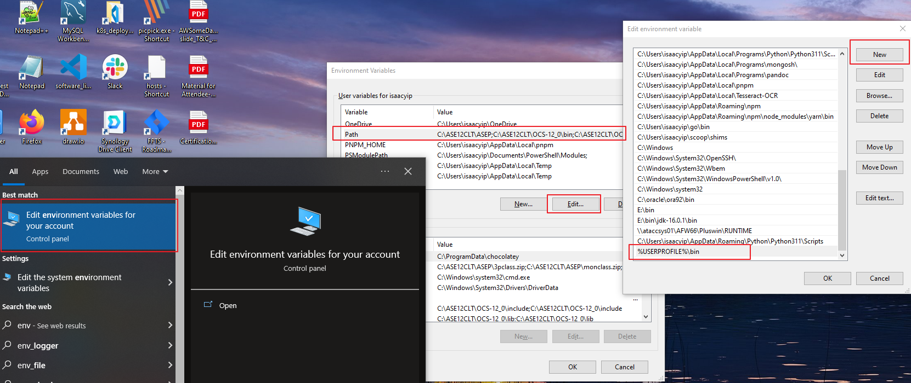

# init prepare

## install harbor and gitlab server cert

1. download server cert

   ```bash
   # run in git bash
   mkdir $HOME/temp
   # download gitlab server cert
   echo -n | openssl s_client -connect 192.168.64.188:443 | openssl x509 > $HOME/temp/192.168.64.188.crt
   # download harbor server cert
   echo -n | openssl s_client -connect 192.168.64.186:443 | openssl x509 > $HOME/temp/192.168.64.186.crt
   ```

2. add server cert to root trust store

   ```powershell
   # run in powershell
   Import-Certificate -FilePath "$HOME/temp/192.168.64.188.crt" -CertStoreLocation cert:\CurrentUser\Root
   Import-Certificate -FilePath "$HOME/temp/192.168.64.186.crt" -CertStoreLocation cert:\CurrentUser\Root
   ```

3. need restart `docker` after add cert to trust store

## perpare zip command

1. download zip for cmd http://downloads.sourceforge.net/gnuwin32/zip-3.0-bin.zip, copy `zip.exe` to `%USERPROFILE%\bin`
   
2. add `%USERPROFILE%\bin` to env var `PATH`
   

## perpare deploy project and python

3. download project

   ```
   git clone https://192.168.64.188/bes/k8s_deployment
   ```

4. install python lib
   ```bash
   pip install -r k8s_deployment/scripts/requirements.txt
   ```

## handover

1.  TOMS deployment  
    https://192.168.64.188/bes/k8s_deployment/-/tree/master/deploy_toms
2.  Create New APP in BES  
    https://192.168.64.188/bes/k8s_deployment/-/blob/master/doc/create_new_bes_app/create_new_bes_app.md
3.  Create New Set of App for new Tunnel (CHT, EHT, WHT, ABT, TLT)  
    https://192.168.64.188/bes/k8s_deployment/-/blob/master/doc/das_new_tunnel_app.md
4.  Deployment Script/Method  
    https://192.168.64.188/bes/k8s_deployment/-/blob/master/scripts/print_docker_image_command.py
5.  Add log code change for elasticsearch  
    https://192.168.64.188/bes/k8s_deployment/-/blob/master/doc/config_log_to_elastic.md
6.  Gafana - Database matrix
7.  ETL - Json to elasticsearch
8.  Config check/comparison in Isaac local
9.  Harbor full disk solution  
    https://192.168.64.188/bes/k8s_deployment/-/tree/master/doc/how_to_resize_vm_disk
10. GitLab full disk solution  
    https://192.168.64.188/bes/k8s_deployment/-/tree/master/doc/how_to_resize_vm_disk
11. Pulsar Clear backlog  
    https://192.168.64.188/bes/k8s_deployment/-/blob/master/doc/pulsar_command.md
12. delpoy another branch to np  
    https://192.168.64.188/bes/k8s_deployment/-/tree/master/doc/delpoy_another_branch_to_np
13. compare p1, p2 image version  
    https://192.168.64.188/bes/k8s_deployment/-/blob/master/doc/compare_image_version.md
14. rollback image version in np, p1, p2  
    https://192.168.64.188/bes/k8s_deployment/-/tree/master/doc/rollback_image_version
15. use dll in win form project  
    https://192.168.64.188/bes/k8s_deployment/-/tree/master/doc/use_dll_in_win_form_project
16. gitlab daily backup  
    https://192.168.64.188/bes/k8s_deployment/-/tree/master/doc/gitlab_backup
17. Install Root Cert in K8s (Renew/Replace)  
    https://192.168.64.188/bes/k8s_deployment/-/tree/master/doc/renew_root_ca_cert
18. Setup CronJob in K8s  
    https://192.168.64.188/bes/k8s_deployment/-/blob/master/doc/create_new_bes_app/create_new_bes_app.md
19. Command to generate new root CA cert  
    https://192.168.64.188/bes/k8s_deployment/-/tree/master/doc/renew_root_ca_cert
