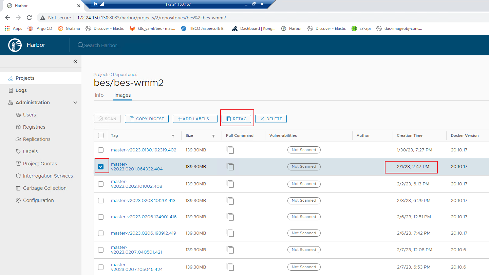
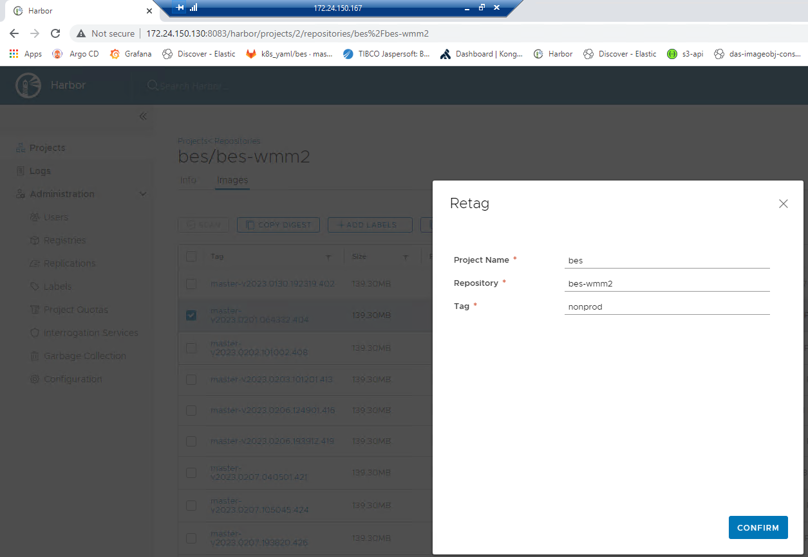
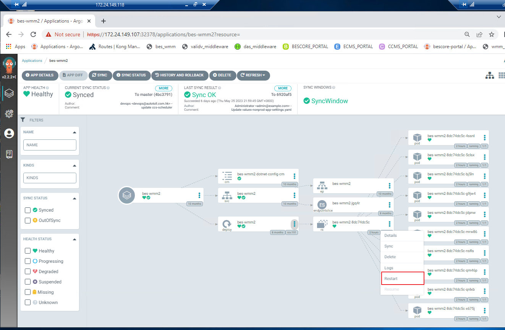

# rollback image version

1. go to nonprod/p1/p2 harbor, pick the image you want to rollback base on "Creation Time", click "RETAG"
   
2. retag the image as nonprod | p1 | p2
   
3. restart app in argocd
   
