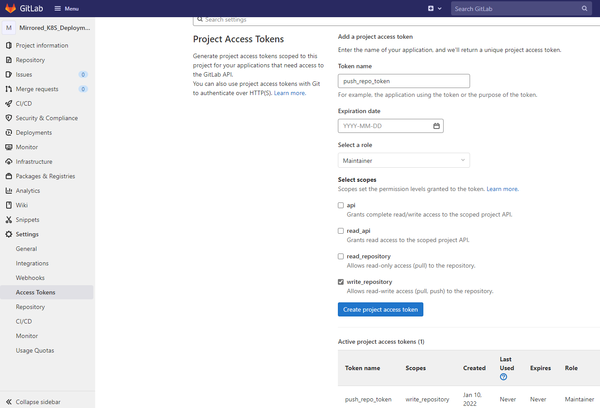
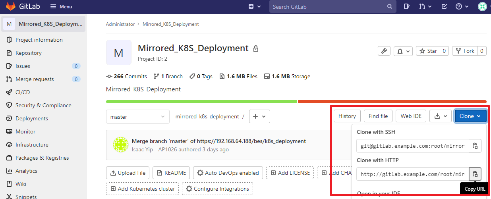
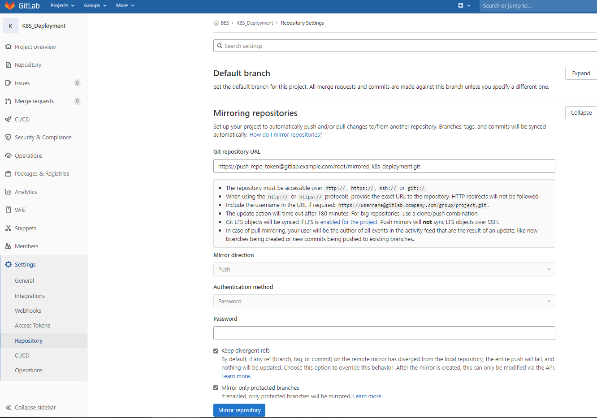
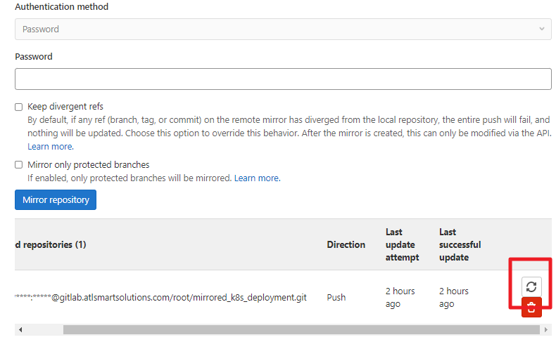

# Setup Mirror GitLab Repo

## Note

1. GitLab [push mirror][1] require licence, we use [pull mirror][2] here. 

2. Only k8s deployment yaml files need to be mirrored.
3. This doc describe deploy from `Testing` to `DEV`

## Create Access Token

1. Login `DEV` GitLab.

2. Create a blank project.

3. Go to project page, go to menu `Settings > Access Tokens`, create a token with `write_repository` scopes.
   

4. Go to project page, copy the `clone with HTTPS` URL.
   Add your token name before host name `https://push_repo_token@gitlab.example.com/root/mirrored_k8s_deployment.git`
   We will use this in setup mirror repo.

   

## Setup mirror repo

1. Login `Testing` GitLab

2. Go to project `K8S_Deployment`, go to menu `Settings > Repository`

3. Config the git repo URL you just copy.
   Input your access token in `password` field.
   Check the box `Keep divergent refs` and `Mirror only protected branches`
   
   
4. After setup, `Dev` repo will updated when commits are pushed to `Testing` GitLab
   
   Or you can [manually update][3] it. 
   
   
   
   

## Ref Doc

[1]: https://docs.gitlab.com/ee/user/project/repository/mirror/push.html) "GitLab Push Mirror"

[2]: https://docs.gitlab.com/ee/user/project/repository/mirror/pull.html	"GitLab Pull Mirror"
[3]: https://docs.gitlab.com/ee/user/project/repository/mirror/index.html#force-an-update)	"Force an update| GitLab"
