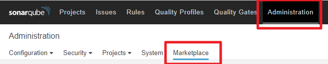
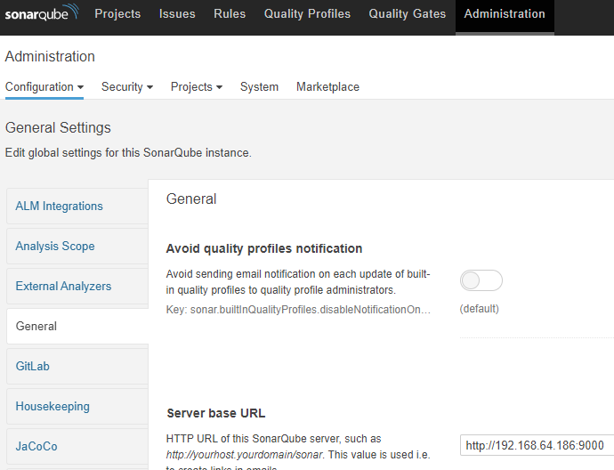
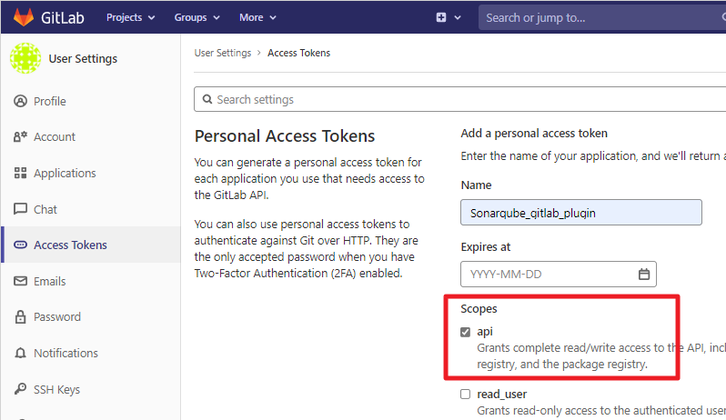
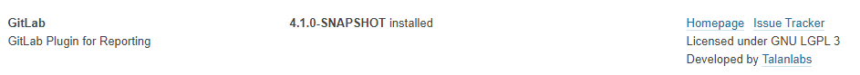
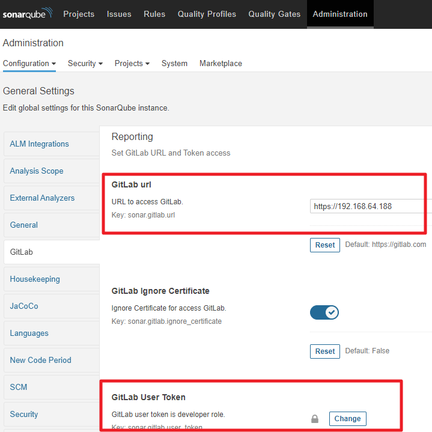
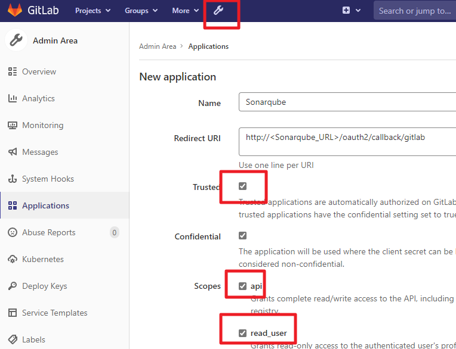
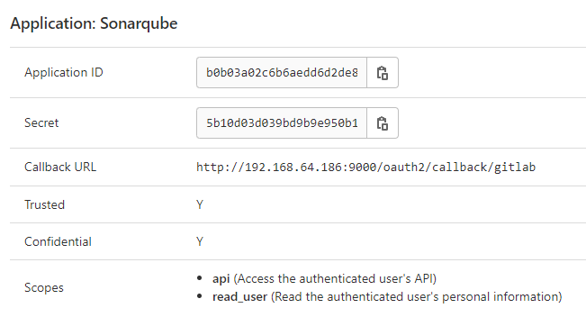
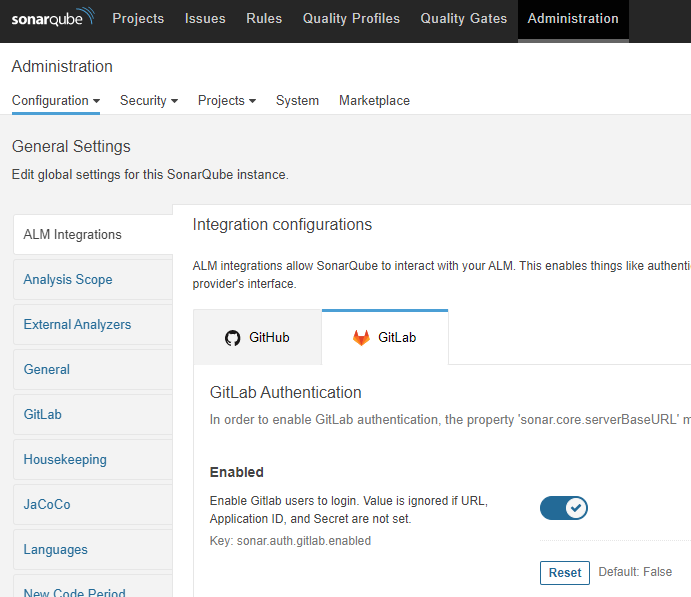
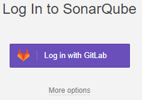

# Sonarqube


## Installation

1. [Install the Server | SonarQube Docs](https://docs.sonarqube.org/latest/setup/install-server/)

2. Install Plugin that you need

   Login SonarQube, **Administratrion > Marketplace**
   

3. Set Server base URL

   **administration > configuration > general > general > Server base URL**

   
   

## GitLab Plugin Integration

[gabrie-allaigre/sonar-gitlab-plugin](https://github.com/gabrie-allaigre/sonar-gitlab-plugin)

1. Gen GitLab **Access Token**, with **api** scopes.
   
2. Login SonarQube, Go to **Administratrion > Marketplace**, Install GitLab Plugin.
   
3. Go to **Administratrion > configration > GitLab**, Input **GitLab URL, GitLab User Token**
   

## GitLab CI file

- Official Template
  [lib/gitlab/ci/templates · master · GitLab.org / GitLab FOSS · GitLab](https://gitlab.com/gitlab-org/gitlab-foss/-/tree/master/lib/gitlab/ci/templates)
  
- Reference
  [Keyword reference for the .gitlab-ci.yml file | GitLab](https://docs.gitlab.com/ee/ci/yaml/)
  
- Example

  ```yaml
  # define stages
  stages:
    - code_scan
    - test
    - build
  
  # define global setting, could overwrite in job
  variables:
  
  # start define job
  code_scan:
    stage: code_scan
    image:
      name: mcr.microsoft.com/dotnet/sdk:latest
      entrypoint: [""]
    variables:
      # Var for sonar-scanner
      SONAR_HOST_URL: "http://192.168.64.186:9000/"
      SONAR_TOKEN: "3875e21de23377af3941b97c168119410f803f2e"
      GIT_DEPTH: "0"  # Tells git to fetch all the branches of the project,   required by the analysis task
      SONAR_USER_HOME: "${CI_PROJECT_DIR}/.sonar"  # Defines the location of  the analysis task cache
    cache:
      key: "${CI_JOB_NAME}"
      paths:
        - .sonar/cache
    before_script: 
      - export # print env var for debug
    script:
      - apt-get update
      - apt-get install --yes openjdk-11-jre
      - dotnet tool install --global dotnet-sonarscanner
      - export PATH="$PATH:$HOME/.dotnet/tools"
      - dotnet sonarscanner begin 
        /k:"$CI_PROJECT_NAME-$CI_COMMIT_BRANCH" 
        /d:sonar.login="$SONAR_TOKEN" 
        /d:sonar.host.url=$SONAR_HOST_URL
        /d:sonar.gitlab.project_id=$CI_PROJECT_ID
        /d:sonar.gitlab.commit_sha=$CI_COMMIT_SHA 
        /d:sonar.gitlab.ref_name=$CI_COMMIT_REF_NAME
      - dotnet build
      - dotnet sonarscanner end /d:sonar.login="$SONAR_TOKEN"
    # if scan fail, pipelines will stop at this stages
    allow_failure: false
  
  unit_test:
    stage: test
    image: mcr.microsoft.com/dotnet/sdk:5.0
    script: 
      - dotnet test # Run .net unit test
  
  build:
    stage: build
    image: docker:20
    services:
      - docker:20-dind
    needs: 
      - unit_test
    tags:
      - isaac-runner
    before_script: 
      - ls # print file ls for debug
    script:
      - docker build -t "$CI_REGISTRY/$CI_REGISTRY_PROJECT/$CI_REGISTRY_IMAGE:$CI_COMMIT_BRANCH" -f $CI_PROJECT_NAME/Dockerfile .
      - docker login -u "$CI_REGISTRY_USER" -p "$CI_REGISTRY_PASSWORD" $CI_REGISTRY
      - docker push "$CI_REGISTRY/$CI_REGISTRY_PROJECT/$CI_REGISTRY_IMAGE:$CI_COMMIT_BRANCH"
  ```

  
## ALM Integration

[GitLab Integration | SonarQube Docs](https://docs.sonarqube.org/latest/analysis/gitlab-integration/)

1. Create Applications in GitLab Admin Area
   
2. Copy **Application ID** and **Secret**
   
3. Config SonarQube Server, **Administration > Configuration > ALM Integrations > GitLab**
   Enable GitLab, input **GitLab URL, Application ID, Secret,**
   
4. Back to login page, you should able to login with GitLab
   
