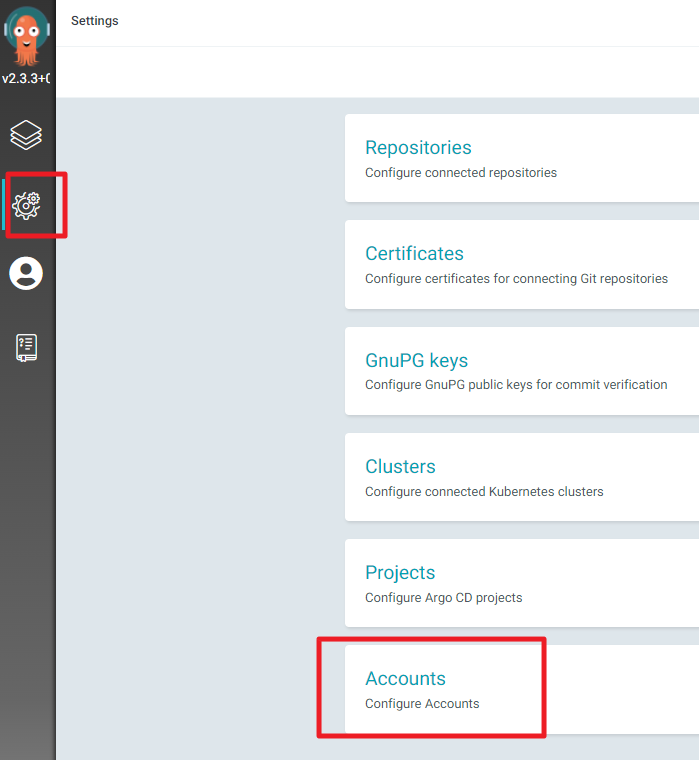
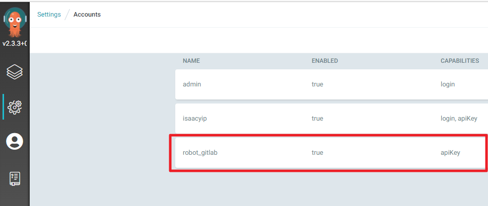
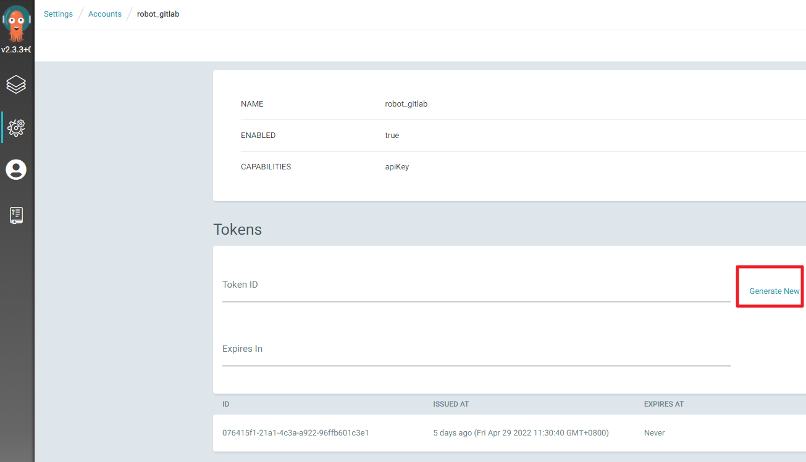

# Install ArgoCD Server

[Getting Started - Argo CD - Declarative GitOps CD for Kubernetes (argoproj.github.io)](https://argoproj.github.io/argo-cd/getting_started/)

```shell
# install argocd to k8s
kubectl create namespace argocd
kubectl apply -n argocd -f https://raw.githubusercontent.com/argoproj/argo-cd/stable/manifests/ha/install.yaml

# watch until all pods is running
watch -n1 kubectl get pods --namespace=argocd
# press (ctrl + c) to exit
```

## Expose service by nodeport

```shell
cat <<EOF | kubectl apply -n argocd -f -
apiVersion: v1
kind: Service
metadata:
  labels:
    app.kubernetes.io/component: server
    app.kubernetes.io/name: argocd-server
    app.kubernetes.io/part-of: argocd
  name: argocd-server-external
spec:
  ports:
  - name: http
    port: 80
    protocol: TCP
    targetPort: 8080
    nodePort: 31005
  selector:
    app.kubernetes.io/name: argocd-server
  type: NodePort
EOF
```

URL : `https://<k8s-server-ip>:31005/`

## Get default admin password

Default password will change when restart the pod
Default username is **admin**

```shell
# you can get default admin password by this command
kubectl -n argocd get secret argocd-initial-admin-secret -o jsonpath="{.data.password}" | base64 -d && echo
```

## Change ArgoCD admin password

```shell
# Warnning! you should do the encryption in other computer for security reason
ARGOCD_PASSWORD="123456"
ARGOCD_ENCERYPTED_PASSWORD=$(htpasswd -bnBC 10 "" $ARGOCD_PASSWORD | tr -d ':\n')

kubectl patch secret --namespace=argocd argocd-secret -p '{"stringData": { "admin.password": "'$ARGOCD_ENCERYPTED_PASSWORD'"}}'

# clear password
unset ARGOCD_PASSWORD
unset ARGOCD_ENCERYPTED_PASSWORD
history -cw
```

## Add api account for CI/CD

```
kubectl apply -f argocd_account.yaml
```

## Generate api token for CI/CD





token will used in gitlab-ci `ARGOCD_TOKEN`

https://192.168.64.188/bes/k8s_deployment/-/blob/master/gitlab_ci_templates/common.gitlab-ci.yml

## Expose service by Ingress (optional)

1. Install one of ingress controller first
   [Nginx_ingress_installation.md](Nginx_ingress_installation.md)
   [Other Ingress Controllers | Kubernetes](https://kubernetes.io/docs/concepts/services-networking/ingress-controllers/)
2. Create tls secret for https

   ```shell
   MY_DOMAIN="ffts.com"
   MY_APP_NAME="argocd"
   MY_HOST="$MY_APP_NAME.$MY_DOMAIN"
   MY_SERVER_IP="192.168.64.200"

   cd ~/Desktop/certs

   #gen self sign cert for testing
   openssl req -x509 -nodes -days 365 -newkey rsa:2048 -keyout $MY_HOST.key -out $MY_HOST.crt -subj "/CN=$MY_HOST/O=$MY_HOST" -addext subjectAltName=DNS:localhost,DNS:$MY_HOST,IP:$MY_SERVER_IP

   #Preview tls secret yaml file
   kubectl create secret tls $MY_APP_NAME-tls-secret --key=$MY_HOST.key --cert=$MY_HOST.crt --namespace=$MY_APP_NAME --dry-run=client --output=yaml

   #Create tls secret in k8s
   kubectl create secret tls ${MY_APP_NAME}-tls-secret --key=$MY_HOST.key --cert=$MY_HOST.crt --namespace=${MY_APP_NAME}

   unset MY_DOMAIN
   unset MY_APP_NAME
   unset MY_HOST
   unset MY_SERVER_IP
   ```

3. Apply Ingress

   ```shell
   cat <<EOF | kubectl apply -f -
   apiVersion: networking.k8s.io/v1
   kind: Ingress
   metadata:
     name: argocd-server-ingress
     namespace: argocd
   spec:
     tls:
     - hosts:
       - argocd.ffts.com
     - secretName: argocd-tls-secret
     rules:
     - host: argocd.ffts.com
       http:
         paths:
         - path: /
           pathType: Prefix
           backend:
             service:
               name: argocd-server
               port:
                 name: https
   EOF
   ```

4. Add IP to your host file

   ```
   echo 192.168.64.200 argocd.ffts.com >> /etc/hosts
   ```

   For Windows `C:\Windows\System32\drivers\etc\hosts`

5. now you should able to access from browser https://argocd.ffts.com
   If you see `ERR_TOO_MANY_REDIRECTS `, use below command

   ```shell
   kubectl patch deployment argocd-server -n argocd --type json -p='[ { "op": "replace", "path":"/spec/template/spec/containers/0/command","value": ["argocd-server","--staticassets","/shared/app","--insecure"] }]'

   # wait until new pod is running and old pod is terminated
   watch -n1 kubectl get pods --namespace=argocd
   # [cutl + c] to exit
   ```

## Q&A Error

1. ```
   Error from server (InternalError): error when creating "STDIN": Internal error occurred: failed calling webhook "validate.nginx.ingress.kubernetes.io": Post "https://ingress-nginx-controller-admission.ingress-nginx.svc:443/networking/v1beta1/ingresses?timeout=10s": context deadline exceeded
   ```

   Fix

   ```
   kubectl delete -A ValidatingWebhookConfiguration ingress-nginx-admission
   ```

2. Server keep redirect

   ```
   ERR_TOO_MANY_REDIRECTS
   ```

   Fix

   ```shell
   kubectl patch deployment argocd-server --type json -p='[ { "op": "replace", "path":"/spec/template/spec/containers/0/command","value": ["argocd-server","--staticassets","/shared/app","--insecure"] }]' -n argocd
   ```
