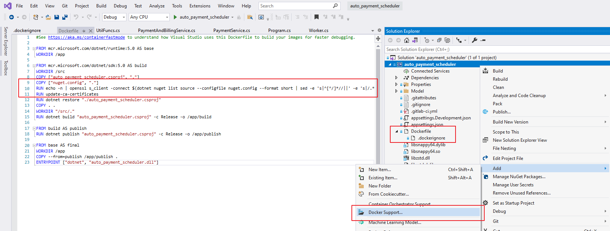
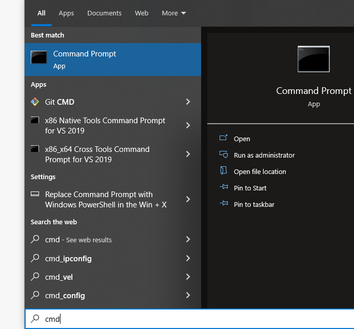
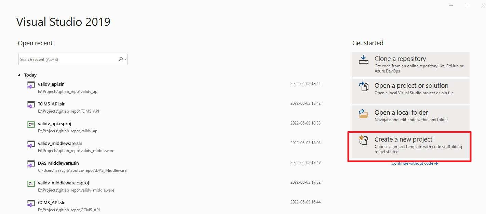
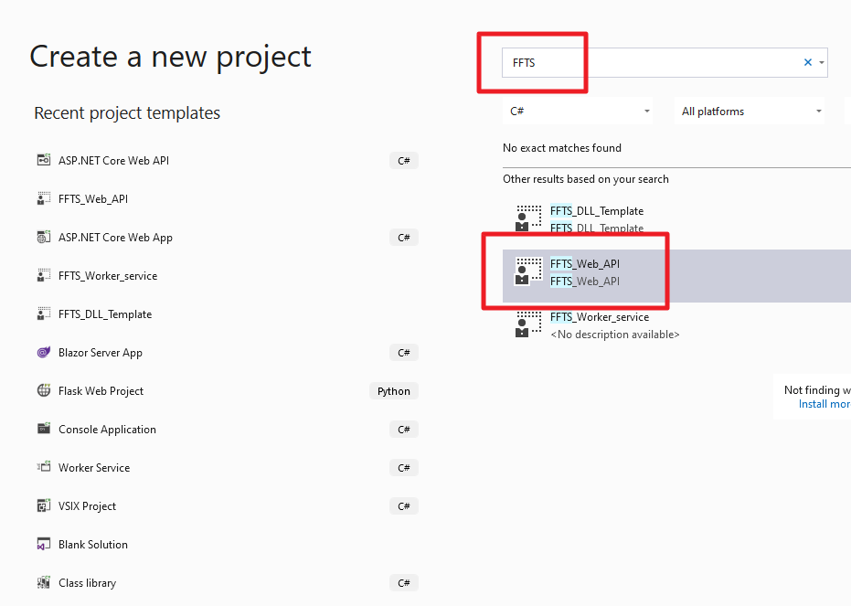
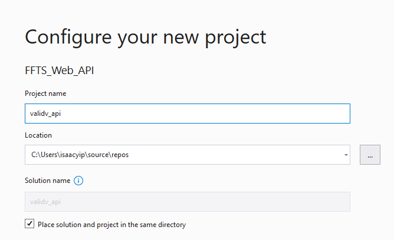
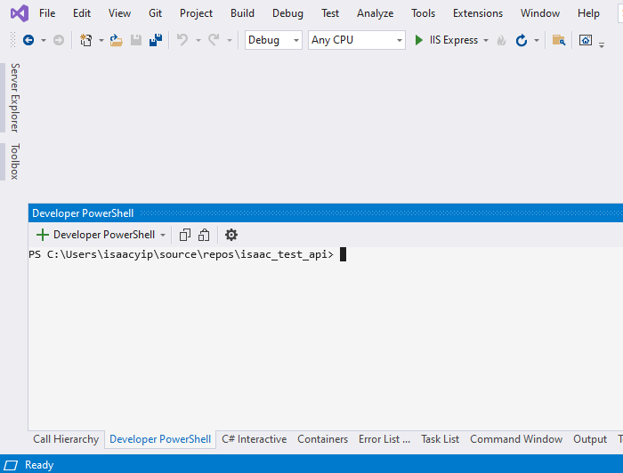

# How to new project

## concept

1. create project with visual studio
2. add Dockerfile, .dockerignore to project
   
3. add three line to docker file

   ```dockerfile
   COPY ["nuget.config", "."]
   RUN echo -n | openssl s_client -connect $(dotnet nuget list source  --configfile nuget.config --format short | sed -e 's|^[^/]*//||' -e 's|/.*$||    ') | openssl x509 > /usr/local/share/ca-certificates/packageSources.crt
   RUN update-ca-certificates
   ```

4. add gitlab-ci.yml to project

   ```yaml
   variables:
     # ZONE folder name: dmz-bes | bes | toms
     ZONE: "<zone-folder-name>"
     ARGOCD_PROJECT_NAMESPACE: "bes"
     ARGOCD_PROJECT_NAME: <app-name>
     HARBOR_REPOSITORIES: "bes/<app-name>"

   include:
     - project: "bes/k8s_deployment"
       file: "/gitlab_ci_templates/common.gitlab-ci.yml"
   ```

## Use project template (optional)

open windows cmd


```shell
curl "https://192.168.64.188/bes/k8s_deployment/-/raw/master/doc/how_to_new_project/FFTS_Web_API_Template.zip" -o "%USERPROFILE%\Documents\Visual Studio 2019\Templates\ProjectTemplates\FFTS_Web_API_Template.zip"

curl "https://192.168.64.188/bes/k8s_deployment/-/raw/master/doc/how_to_new_project/FFTS_Worker_service.zip" -o "%USERPROFILE%\Documents\Visual Studio 2019\Templates\ProjectTemplates\FFTS_Worker_service.zip"

unzip "%USERPROFILE%\Documents\Visual Studio 2019\Templates\ProjectTemplates\FFTS_Web_API_Template.zip"
unzip "%USERPROFILE%\Documents\Visual Studio 2019\Templates\ProjectTemplates\FFTS_Worker_service.zip"
```

## Create project with visual studio





## Push project to gitlab

Press `` Ctrl + ` `` in visual studio to open powershell



```powershell
# $PROJECT_GROUP= ["group" | "group/sub_group"]
$GITLAB_GROUP="bes"

$GITLAB_PROJECT_NAME="Tx_Validation_Backlog"
$PROJECT_GIT_REPO="https://192.168.64.188/${GITLAB_GROUP}/${GITLAB_PROJECT_NAME}.git"

git init
git add .
git commit --all --message "init project"
git push --set-upstream "${PROJECT_GIT_REPO}" master
```
